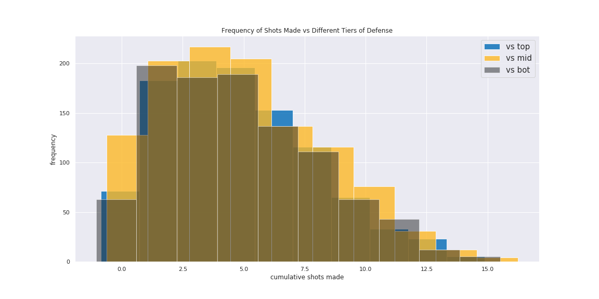

# Player Performance Prediction Report

<!-- 
The problem you are addressing, particularly how you refined the provided idea.

The data that you used: how it was gathered, cleaned, etc.

Techniques you used to analyse the data.

Your results/findings/conclusions.

Some appropriate visualization of your data/results.

Limitations: problems you encountered, things you would do if you had more time, things you should have done in retrospect, etc. 
-->
---

## Problem, Refinement, Hypothesis

### Identification

Stephen Curry is the best shooter that has ever graced the NBA and is soley responsible for the rennaissance of the three-point era. His marksmanship lead him to his first MVP in 2014-15 and subsequently becoming the first unanimous MVP in 2015-16 the year after. Given his unparalled skillset, *we wonder how much of his shooting performance (shots made) is influenced by the opposing defense*.

### Idea

For a decent measure of a team's defensive potency, we will be using ESPN John Hollinger's *defensive efficiency* or more commonly *defensive rating* stat that estimates the number of points a team allows per 100 possessions. We will be ranking and binning the teams into three categories based on their [defensive ratings](#team-defensive-rating-data-from-2009-2019) - top, middle, and bottom defensive ratings.

We are primarily interested in the number of shots Curry makes as time passes in a game, specifically the cumulative number of shots`cum_shot_made`.

### Hypothesis Testing

Since we are looking to test whether or not there is a difference between his shooting performances, we will perform a statistical analysis to verify our suspicions. We will have an initial assumption that there *is no statistical difference* between his performance against the different tiers (null hypothesis). Alternatively if that were to be proven wrong ($p-value < 0.05$), then we can assume that there *is a statistically significant difference* between the tiers (alternative hypothesis).

---

## Data Collection, Cleaning, and Preprocessing Process

A majority of our data was collected from [basketball-reference.com](https://www.basketball-reference.com/), [pbpstats.com](http://www.pbpstats.com/), and [stats.nba.com](https://stats.nba.com/).

### Webscrape

We were unable to access play-by-play data online without being met by a pay wall. Luckily enough, we found [shooting chart data](https://www.basketball-reference.com/players/c/curryst01/shooting/2018) on basketball-reference. Each of marks on the chart represents a shot Curry took in that respective season and was embedded as data in an html element. Given that it is an HTML element, we realized that we could scrape the data online and format it into our own dataset.

The webscrape parses data points in the form

```python
<div class="tooltip make" style="top:292px;left:335px;" tip="Oct 17, 2017, GSW vs HOU&lt;br&gt;1st Qtr, 8:09 remaining&lt;br&gt;Made 3-pointer from 25 ft&lt;br&gt;GSW now leads 15-7">●</div>
```

and cleans / transforms it into a dataframe with this sample row

| date | home | vs | quarter | time_left | shot_made | shot_value | shot_distance | x | y | shot_description | game_score |
| --- | --- | --- | --- | --- | --- | --- | --- | --- | --- | --- | --- |
| 2017-10-17 | True | HOU | 1 | 08:09 | True | 3 | 25 | 335 | 292 | Made 3-pointer from 25 ft | GSW now leads 15-7 |

We ran `shot_webscrape.py` 10 times for each of the seasons Curry played since his rookie year of 2009 to last season 2019. We collected 13,905 rows which should represnet the total number of shots Curry took in his career up until the end of the 2019 season. The results of our data collected can be seen in the `/data/shooting/curry-2009-2019/` in the projecte directory.

For more information about our webscrape script, refer to our `README.md` on how to use it and `/scripts/shot_webscrape.py` to see the code.

### Team Defensive Rating Data from 2009-2019

Given that our shot data for Curry spans over 10 years, we decided it would be appropriate to take team defensive data over 10 years as well. Our goal was to come up with a decisive list of the decade's best defensive teams and rank them accordingly.

We gathered each team's historical defensive ratings data from 2009-2019 through [stats.nba.com](https://stats.nba.com/). During this period, three teams underwent rebrandings. We cleaned our collected files in `/data/defensive-rating/` and matched the *old team names* with their current team names.

- *Charlotte Bobcats* == Charlotte Hornets
- *New Jersey Nets* == Brooklyn Nets
- *New Orleans Hornets* == New Orleans Pelicans

We then aggregated the defensive rating data for each team and averaged it to get a 10 year average defensive rating. We then re-ranked the teams accordingly and added acronyms for each team for use in [preprocessing](#preprocessing). Finally we exported it as `tm-defrtg-avg-2009-2019.csv`. The graph below shows our resulting aggregated defensive ratings.


The steps in this process were done in the jupyter notebook found in `/scripts/DefensiveRatings_teams.ipynb`.

### Preprocessing

After collecting the data, our main preprocessing work was to combine all the webscraping data into one dataframe that was exported as the csv file, `/data/shot-data-all.csv`. We added a column for cumulative shots made, cumulative attempts, and cumulative field goal percentage (made / attempts).

With the aggregated defensive ratings from the previous [section](#team-defensive-rating-data-from-2009-2019), we split teams into three tiers based on their 10 year defensive rankings - top, middle, and bottom. We subsetted Curry's shooting data from `shot-data-all.csv` into individual csv's `/data/top-def.csv`, `/data/mid-def.csv`, and `/data/bot-def.csv`. By separating out Curry's shooting data by tier, we can then analyze and check whether there is a stasitical significance in his shooting performances against each tier.

For more information on the steps we took for preprocessing, refer to the jupyter notebook `/scripts/combine_shooting_data.ipynb`.

---

## Techniques

### ML Regression Model Pipeline

<!-- 
GOAL: REGRESSION FOR CUMULATIVE SHOTS MADE

Done: 
    Purpose of regression model
        too much data -> many columns
        normal regression accuracy is terrible

    gradient boost > linear regress

To Do: 
model pipeline -> transforming data

overfitting and underfitting
 -->
Our goal with this Machine Learning model is to predict the cumulative shots made, `cum_shots_made` with respect to 8 different features.

```python
['game_time','shot_made','quarter','home','shot_distance','shot_value','cum_attempts','cum_fg_percent']
```

Each of our features are measured and scaled differently - making them incomparable. To resolve this issue we used `StandardScaler()` to make them comparable.

Our play-by-play shooting data is dependent on each other since each feature influences the success rate of a shot. Given this issue, we learned that one of Principle Component Analysis's (PCA) strengths is in [transforming the features to become independent](https://towardsdatascience.com/a-one-stop-shop-for-principal-component-analysis-5582fb7e0a9c) through its intermediary steps. Given that all 8 of our features are pertinent towards the shot success rate, we kept all features when applying PCA.

Initially we tried a basic `LinearRegression()` model on our data but found that our results were inaccurate (validation score of 0.50096). We assumed that the regular regression model had trouble making sense of all our features (n features = 8). So we decided to implement `GradientBoostingRegressor()` with `n_estimators = 100` and `learning_rate = 0.1`. Gradient Boosting was a good solution since we can let the model decide which features were identified incorrectly and apply appropriate weighting to the decision trees (learning rate).

```python
model = make_pipeline(
    StandardScaler(),
    PCA(8),
    GradientBoostingRegressor(), # defaults: n_estimator = 100, learning_rate = 0.1
)
```

### Statistical Tests

Given that we are testing for differences between the tiers of team defenses, ANOVA is a suitable choice. Before we proceed, we verify that the conditions and assumptions for this statistical test are met:

  1. observations are indenpdent and identically distributed,
  2. groups are normally distributed,
  3. and groups have equal variance.

We assume that shots are independent of each other, that is each shot does not influence the success rate of the other. Our sample size is $n > 1000$ for each set, therefore through the Central Limit Theorem we can assume normality. To check for equal variance, we performed a levene test and achieved a `p-value = 0.14840`. This is also reflected in the graph below. Therefore, all the conditions of ANOVA are met.



### Model Application

We split our data with `train_test_split(X, y)` and trained each of the three data sets individually then used it predict the `cum_shot_made` column for each tier.

Details can be seen in our file `/data/statistical_analysis.ipynb`.

---

## Results

<!-- 
Things to talk about:

ANOVA results
inference
takeaways
 -->

### ANOVA

After simulating the regression model multiple times, the majority of the scenarios resulted in a `p-value > 0.05`. Therefore, we fail to reject the null hypothesis and conclude that there is no significant statistical difference between Curry's performance against different tiers of defensive teams.

### Inference

Based on our outcome, we found that Curry is remarkably consistent in the number of shots he makes regardless of the defensive potency of the other team.

However, we found that Curry seems to have a tendency to make a lot more shots, or in basketball lingo *explode*, in the first quarter against teams in the lower defensive ratings. 

For this experiment, we were examining Team Defense Rating and found no results. However, the results may perhaps be different if instead our scope shifted to looking at player matchups rather than the team collectively. 


### Overfitting or Underfitting

- Based on our training and validation score, we managed to achieve (*insert the 3 models with training and valid score*)
  - concludes that we arent over fitting
  - Talk about our accuracy using *r2_score*, using 2017-2018 and 2018-2019 as our input. (He mentioned to include 2 or more inputs)

## Limitations

Our initial question was to answer Curry's performance against other teams given a certain matchup. Though, we had some difficulties finding his performances for his matchup against opponents. We discovered [nba_api](https://github.com/swar/nba_api) and thought we could utilize their api and it has provided us play-by-play stats. From their api, the documentation were not clear and that there were many bugs that we discovered while using it. Furthermore, connections would time out frequently regardless of the size request. In the end, we managed to obtain matchup data except that the data came aggregated and that there were very few points for us to use.

We also found data on Curry's shooting chart from [basketball-reference.com](https://www.basketball-reference.com/) with data points and information of each point embedded in HTML. We noticed that each of these data points were essentially play-by-play data of every shot he took. We decided to write a script `shot_webscrape.py` that scrapes all the data from the HTML. This results in redefining our question to: Stephen Curry's shot made performace against top, middle, and defensive teams.

Things we would do if we had more time would be get an understanding of [nba_api](https://github.com/swar/nba_api). We could potentially make use of its aggregated data to find something useful such as ? Moreover, we were interested in creating a model to predict other statistical performances from Curry such as assists, rebounds, and turnovers. Since we know that shots made does not fully reflect on players overall performance. We were also interested in predicting his performance against one team instead of defensive rank teams. This is because we want to create an application to gain insight on his performance against one team instead of all ten teams. Additionally, we are looking forward to add certain matchups against Curry based on the team he's facing.

Things we could have done better would be ensuring we had the correct dataset for our problem. Although we thought of many ideas and algorithms on how to implement, it is crucial to understand that data is significant in order to answer our question.

## Project Experience
