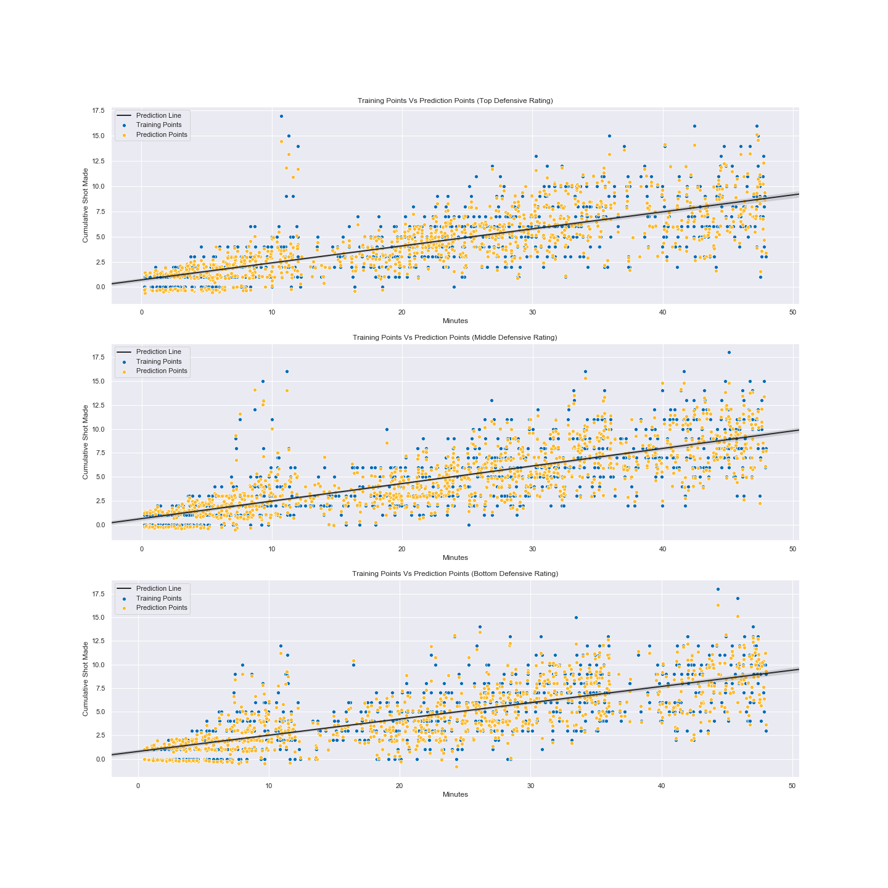

**CMPT 353 Fall 2019**
Angus Hon & Anson Christo

# Player Performance Prediction Report

<!-- 
The problem you are addressing, particularly how you refined the provided idea.

The data that you used: how it was gathered, cleaned, etc.

Techniques you used to analyse the data.

Your results/findings/conclusions.

Some appropriate visualization of your data/results.

Limitations: problems you encountered, things you would do if you had more time, things you should have done in retrospect, etc. 
-->

## Problem, Refinement, Hypothesis

### Identification

Stephen Curry is the best shooter that has ever graced the NBA and is solely responsible for the renaissance of the three-point era. His marksmanship lead him to his first MVP in 2014-15 and to subsequently becoming the first unanimous MVP in 2015-16 the year after. Given his unparalleled skillset, *we wonder how much of his shooting performance (shots made) is influenced by the opposing defense*.

### Idea

For a decent measure of a team's defensive potency, we used ESPN’s John Hollinger's *defensive efficiency* or more commonly *defensive rating* that estimates the number of points a team allows per 100 possessions. We ranked and binned the teams into three categories / tiers based on their [defensive ratings](#team-defensive-rating-data-from-2009-2019) - top, middle, and bottom defensive ratings.

We were primarily interested in the number of shots Curry made as time passes in a game, specifically the cumulative number of shots `cum_shot_made`.

### Hypothesis Testing

We were looking to test whether or not there was a difference between his shooting performances. To do so, we performed a statistical analysis to verify our suspicions. We started with an initial assumption that there *is no statistical difference* between his performances against the teams in different tiers (null hypothesis). Alternatively if that were to be proven wrong ($p-value < 0.05$), then we would assume that there *is a statistically significant difference* in Curry’s performance against teams of different tiers (alternative hypothesis).

---

## Data Collection, Cleaning, and Preprocessing Process

A majority of our data was collected from [basketball-reference.com](https://www.basketball-reference.com/), [pbpstats.com](http://www.pbpstats.com/), and [stats.nba.com](https://stats.nba.com/).

### Webscrape

We were unable to access play-by-play data online without being met by a paywall. Luckily, we found [shooting chart data on basketball-reference](https://www.basketball-reference.com/players/c/curryst01/shooting/2018). Each of the marks on the chart represents a shot Curry took in that season and was embedded as data in an html element. Given that it is an HTML element, we realized that we could scrape the data online and format it into our own dataset.

The webscrape parses data points in the form

```python
<div class="tooltip make" style="top:292px;left:335px;" tip="Oct 17, 2017, GSW vs HOU&lt;br&gt;1st Qtr, 8:09 remaining&lt;br&gt;Made 3-pointer from 25 ft&lt;br&gt;GSW now leads 15-7">●</div>
```

and cleans / transforms it into a dataframe like this sample row

| date | home | vs | quarter | time_left | shot_made | shot_value | shot_distance | x | y | shot_description | game_score |
| --- | --- | --- | --- | --- | --- | --- | --- | --- | --- | --- | --- |
| 2017-10-17 | True | HOU | 1 | 08:09 | True | 3 | 25 | 335 | 292 | Made 3-pointer from 25 ft | GSW now leads 15-7 |

We ran `shot_webscrape.py` 10 times for each of the seasons Curry played since his rookie year in 2009 to his most recent season 2019. We collected 13,905 rows which represent the total number of shots Curry took in his career up until the end of the 2019 season. The results of our data collected can be seen in the `/data/shooting/curry-2009-2019/` in the project directory.

For more information about our webscrape script, refer to our `README.md` on how to use it and `/scripts/shot_webscrape.py` to see the code.

### Team Defensive Rating Data from 2009-2019

Given that our shot data for Curry spans over 10 years, we decided it would be appropriate to take team defensive data over 10 years as well. Our goal was to come up with a decisive list of the decade's best defensive teams and rank them accordingly.

We gathered each team's historical defensive ratings data from 2009-2019 through [stats.nba.com](https://stats.nba.com/). During this period, three teams underwent rebranding. We cleaned our collected files in `/data/defensive-rating/` and matched the *old team names* with their current team names.

- *Charlotte Bobcats* == Charlotte Hornets
- *New Jersey Nets* == Brooklyn Nets
- *New Orleans Hornets* == New Orleans Pelicans

We then aggregated the defensive rating data for each team and averaged it to get a 10 year average defensive rating. We then re-ranked the teams accordingly and added acronyms for each team for use in [preprocessing](#preprocessing). Finally we exported it as `tm-defrtg-avg-2009-2019.csv`. The graph below shows our resulting aggregated defensive ratings.


The steps in this process were done in the Jupyter notebook found in `/scripts/DefensiveRatings_teams.ipynb`.

### Preprocessing

After collecting the data, our main preprocessing work combined all the webscraping data into one dataframe that was exported as the csv file, `/data/shot-data-all.csv`. We added a column for cumulative shots made, cumulative attempts, and cumulative field goal percentages (made / attempts).

With the aggregated defensive ratings from the previous [section](#team-defensive-rating-data-from-2009-2019), we split teams into three tiers - top, middle and bottom - based on their 10 year defensive ratings. We subsetted Curry's shooting data from `shot-data-all.csv` into individual csv's `/data/top-def.csv`, `/data/mid-def.csv`, and `/data/bot-def.csv`. We separated Curry's shooting data against different tiers, then analyzed and checked whether there is a statistical significance in his shooting performances against each tier.

For more information on the steps we took for preprocessing, refer to the Jupyter notebook `/scripts/combine_shooting_data.ipynb`.

---

## Techniques

### ML Regression Model Pipeline

<!-- 
GOAL: REGRESSION FOR CUMULATIVE SHOTS MADE

Done: 
    Purpose of regression model
        too much data -> many columns
        normal regression accuracy is terrible

    gradient boost > linear regress

To Do: 
model pipeline -> transforming data

overfitting and underfitting
 -->
Our goal with this Machine Learning model was to predict the cumulative shots made, `cum_shots_made` with respect to 8 different features.

```python
['game_time','shot_made','quarter','home','shot_distance','shot_value','cum_attempts','cum_fg_percent']
```

Each of our features were measured and scaled differently - making them incomparable. To resolve this issue we used `StandardScaler()` to make them comparable.

Our play-by-play shooting data is dependent on each other since each feature influences the success rate of a shot. Given this issue, we learned that one of Principle Component Analysis's (PCA) strengths is in [transforming the features to become independent](https://towardsdatascience.com/a-one-stop-shop-for-principal-component-analysis-5582fb7e0a9c) through its intermediary steps. Given that all 8 of our features are pertinent toward the shot success rate, we kept all features when applying PCA.

Initially we tried a basic `LinearRegression()` model on our data but found that our results were inaccurate (validation score of 0.50096). We assumed that the regular regression model had trouble making sense of all our features (n features = 8). So we implemented `GradientBoostingRegressor()` with `n_estimators = 100` and `learning_rate = 0.1`. Gradient Boosting was a good solution since the model decides which features were identified incorrectly and applies appropriate weights to the decision trees (learning rate).

```python
model = make_pipeline(
    StandardScaler(),
    PCA(8),
    GradientBoostingRegressor(), # defaults: n_estimator = 100, learning_rate = 0.1
)
```

### Statistical Tests

Given that we were testing for differences between the tiers of team defenses, ANOVA was the correct choice. Before we proceeded, we verified that the conditions and assumptions for this statistical test were met:

  1. observations are indenpdent and identically distributed,
  2. groups are normally distributed,
  3. and groups have equal variance.

We assumed that shots are independent of each other, that is, each shot does not influence the success rate of another. Our sample size is $n > 1000$ for each set, therefore through the Central Limit Theorem we can assume normality. To check for equal variance, we performed a levene test and achieved a `p-value = 0.14840`. This is also reflected in the graph below. Therefore, all the conditions of ANOVA are met.


### Model Application

We split our data with `train_test_split(X, y)` and trained each of the three data sets individually then used it to predict the `cum_shot_made` column for each defensive tier.

Details can be seen in our file `/data/statistical_analysis.ipynb`.

---

## Results

<!-- 
Things to talk about:

ANOVA results
inference
takeaways
 -->

### ANOVA

After simulating the regression model multiple times, the majority of the scenarios resulted in a `p-value > 0.05`. Therefore, we failed to reject the null hypothesis and concluded that there **is no significant statistical difference** between Curry's performance against different tiers of defensive teams.

### Inference

Based on our outcome, we found that Curry is remarkably consistent in the number of shots he makes regardless of the defensive potency of the other team.

However, we found that Curry seems to have a tendency to make a lot more shots, or in basketball lingo, *explode*, in the first quarter against teams with lower defensive ratings.


For this experiment, we examined Team Defense Ratings and found no correlation between Curry’s shooting performance against the different defensive tiers. However, the results would perhaps be different if our scope instead shifted to looking at player matchups (whoever is guarding Curry) rather than the team against Curry’s team collectively.

### Overfitting or Underfitting

Based on our training and validation score, we managed to achieve these validation scores.

```output
Training Score on Top DEF RTG is: 0.982
Validation Score on Top DEF RTG is: 0.964

Training Score on Mid DEF RTG is: 0.985
Validation Score on Mid DEF RTG is: 0.985

Training Score on Bot DEF RTG is: 0.988
Validation Score on Bot DEF RTG is: 0.988
```

We can conclude that we did not over fit the data since the training and validation scores have an insignificant difference. The graph below shows the training points, predicted points, and the regression line for each defensive tier.



---

## Limitations

At the start of our project, the original question was *how is Curry's shooting performance against other teams given a certain matchup / matchups on defense?* We had a lot of difficulty finding Curry's performance against different player opponents. At one point, we came upon a very promising [nba_api](https://github.com/swar/nba_api) and thought we could utilize it to retrieve play-by-play stats and matchup data. However, the documentation for the api was not clear and we found that there were many bugs while using it. In addition, the server the api was hosted on frequently timed out regardless of the request size. We left the data we obtained from the api in the project folder `/data/steph-vs-team/` since we spent a sizable amount of time exploring it. In the end, we managed to obtain aggregated matchup data but there were very few points. Thus, we did not use matchup data for our model and had to change our original question.

As we briefly mentioned before in the [webscraping section](#webscrape), we found Curry's shooting chart data from [basketball-reference.com](https://www.basketball-reference.com/) with data points and information of each point embedded in HTML. Each of these data points were essentially play-by-play data of every shot he took. Making the most of what we could find, we redefined our question to explore Stephen Curry's shooting performance against top, middle, and defensive teams.

If we had more time, we would gain a better understanding of [nba_api](https://github.com/swar/nba_api) and could potentially make use of its aggregated matchup data. Shooting is only one dimension of the overall performance of a player. Knowing this, we are also interested in creating a model to predict other statistical metrics for Curry such as assists, rebounds, and turnovers.

We could have improved on ensuring we had the correct dataset to answer our questions. We had a plethora of ideas and algorithms that we wanted to implement but realized that we had to work around the data (limiting factor) and adjust our question accordingly.

---

### Project Experience / Overview

For the majority of the project, we worked very closely with each other and had a big influence on every part of the project. We find it hard to decisively break down our contributions individually, but rather we prefer to see this as a collective effort.

#### Angus' Accomplishment Statements

- Created a web scraper that scrapes 10 years of shooting data which resulted in 14k rows of data from basketball-reference.
- Produced visualizations of Stephen Curry’s performance against top, middle, bottom defensive teams
- Fit and transformed our data into features that we desire into our model.
- Applied a variety of machine learning models to see which is the most efficient and used GradientBoostRegressor to achieve 90-98% accuracy score.

#### Anson's Accomplishment Statements

- Collected and cleaned 10 years of defensive rating data from stats.nba for all 30 NBA Teams.
- Conducted a statistical analysis using ANOVA to see if there was a difference between top, middle, bottom defensive teams.
- Created visualizations of NBA Team’s defensive rating, training data and prediction data of all 3 tiers using scatterplot, and an implementation of a prediction line. 
- Applied a variety of machine learning models to see which is the most efficient and used GradientBoostRegressor to achieve 90-98% accuracy score.
